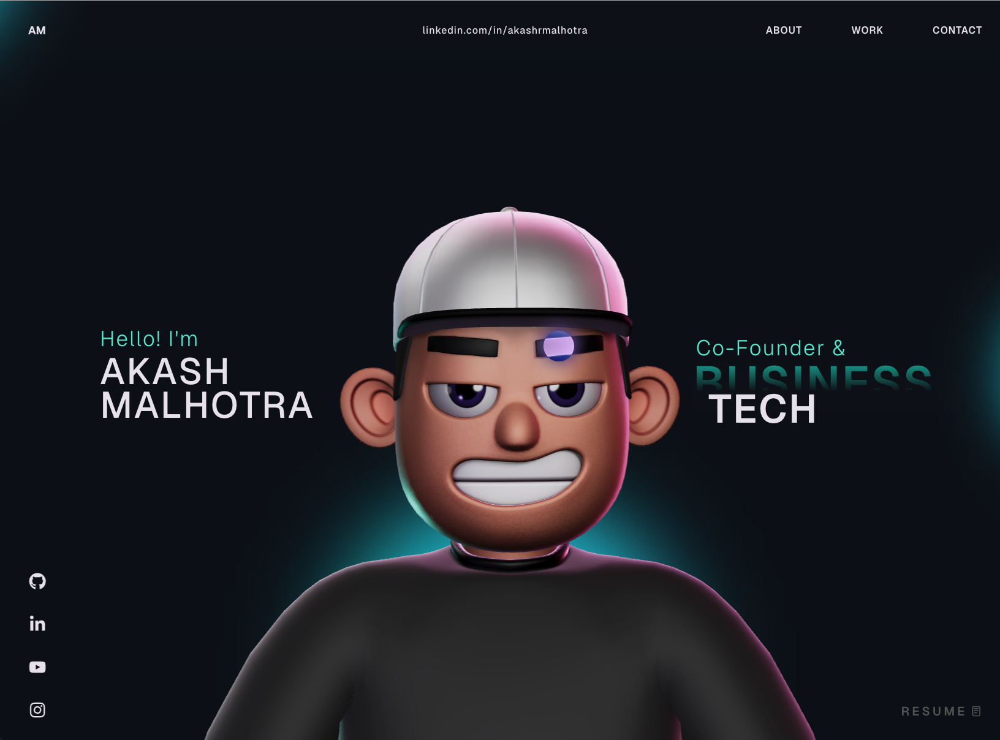

# 3D Portfolio Website

This repository contains the source code for a personal 3D portfolio built with React, TypeScript, Three.js, React Three Fiber, and GSAP. It includes animated page sections, a character scene, custom cursor interactions, and smooth transitions designed for a modern portfolio experience.

Live site: https://my-new-portfolio-beta-three.vercel.app/

Repository: https://github.com/aj0998-dotcom/my-new-portfolio



Live status badge: [](https://my-new-portfolio-beta-three.vercel.app/)

## Table of Contents

- [Features](#features)
- [Tech Stack](#tech-stack)
- [Project Structure](#project-structure)
- [Getting Started](#getting-started)
- [Available Scripts](#available-scripts)
- [GSAP License Note](#gsap-license-note)
- [Customization Guide](#customization-guide)
- [Troubleshooting](#troubleshooting)
- [Deployment](#deployment)
- [License](#license)

## Features

- Responsive one-page portfolio layout with reusable section components.
- 3D character scene rendering powered by React Three Fiber and Three.js.
- GSAP-powered animations and transitions for interactive storytelling.
- Custom cursor, hover interactions, and scroll-driven visual effects.
- Organized component architecture with dedicated utilities and style modules.

## Tech Stack

### Core

- React 18
- TypeScript
- Vite

### Animation and 3D

- GSAP + `@gsap/react`
- Three.js
- `@react-three/fiber`
- `@react-three/drei`
- `@react-three/postprocessing`
- `@react-three/cannon`
- `@react-three/rapier`

### Supporting Libraries

- `react-icons`
- `react-fast-marquee`
- `@vercel/analytics`

## Project Structure

```text
.
├── public/                    # Static assets
├── src/
│   ├── assets/                # Local media/assets
│   ├── components/
│   │   ├── Character/         # 3D scene + character logic/utilities
│   │   ├── styles/            # Section/component CSS files
│   │   ├── About.tsx
│   │   ├── Career.tsx
│   │   ├── Contact.tsx
│   │   ├── Landing.tsx
│   │   ├── MainContainer.tsx  # Main page composition
│   │   ├── Navbar.tsx
│   │   ├── TechStack.tsx
│   │   ├── WhatIDo.tsx
│   │   └── Work.tsx
│   ├── context/               # Global providers (loading state, etc.)
│   ├── data/                  # Static data/content definitions
│   ├── App.tsx
│   └── main.tsx
├── package.json
└── vite.config.ts
```

## Getting Started

### Prerequisites

- Node.js 18+ (recommended)
- npm 9+ (or compatible)

### Installation

1. Clone the repository:

   ```bash
   git clone <your-repository-url>
   cd 3d-portfolio
   ```

2. Install dependencies:

   ```bash
   npm install
   ```

3. Start the local development server:

   ```bash
   npm run dev
   ```

4. Open the URL shown in the terminal (typically `http://localhost:5173`).

## Available Scripts

- `npm run dev`  
  Starts Vite dev server and exposes host for local network testing.

- `npm run build`  
  Type-checks and builds a production-ready bundle.

- `npm run preview`  
  Serves the production build locally for verification.

- `npm run lint`  
  Runs ESLint checks across the project.

## GSAP License Note

This project uses the standard `gsap` package, including bonus plugins now available in the core package.

- Install dependencies with `npm install`.
- If migrating from older setups, remove `gsap-trial` from your project.

Read official installation guidance here: [GSAP Installation Docs](https://gsap.com/docs/v3/Installation/)

## Customization Guide

You can adapt this portfolio to your own profile by updating the following areas:

- **Content sections**: Edit files in `src/components/` such as `About.tsx`, `Career.tsx`, `WhatIDo.tsx`, and `Work.tsx`.
- **Data source**: Update static values in files under `src/data/`.
- **Styling**: Modify component styles in `src/components/styles/` and global styles in `src/index.css` / `src/App.css`.
- **3D scene behavior**: Adjust scene logic in `src/components/Character/` and related utilities.
- **Animations**: Tweak GSAP utilities under `src/components/utils/`.

## Troubleshooting

- **Blank screen in development**  
  Check browser console for module import errors and verify all dependencies are installed.

- **3D performance issues on low-end devices**  
  Reduce scene complexity and post-processing effects in the character/scene utilities.

- **GSAP plugin errors**  
  Ensure you have the correct plugin package and license configuration for your target environment.

- **TypeScript build failures**  
  Run `npm run build` and address reported type errors before deploying.

## Deployment

1. Create a production build:

   ```bash
   npm run build
   ```

2. Validate locally:

   ```bash
   npm run preview
   ```

3. Deploy the generated `dist/` folder to your hosting provider (for example Vercel, Netlify, or Cloudflare Pages).

Triggering a GitHub -> Vercel deploy

If your repository is connected to Vercel (recommended), pushing to the branch configured in Vercel will automatically trigger a new deployment. To update GitHub and trigger a redeploy, run:

```bash
# stage changes
git add -A

# commit with a helpful message
git commit -m "style(work): themed project image container + Work section tweaks"

# push to your default branch (replace `main` if your repo uses a different branch)
git push origin main
```

If your repository isn't connected to Vercel yet, follow these steps:

1. Create a GitHub repository and push the project (see commands above).
2. In the Vercel dashboard, click "Import Project" → select GitHub → choose your repository.
3. Configure the build command (`npm run build`) and the output directory (`dist`), then click "Deploy".

Notes
- After pushing to GitHub, Vercel will pick up the commit and start a deploy automatically (if linked).
- You can view deployment logs in the Vercel dashboard for troubleshooting.

Files changed in this workspace to support the Work section visuals:
- `src/components/styles/Work.css` — added themed container, image filters, and hover effect for project images.

## License

This project is open source and available under the [MIT License](LICENSE).
